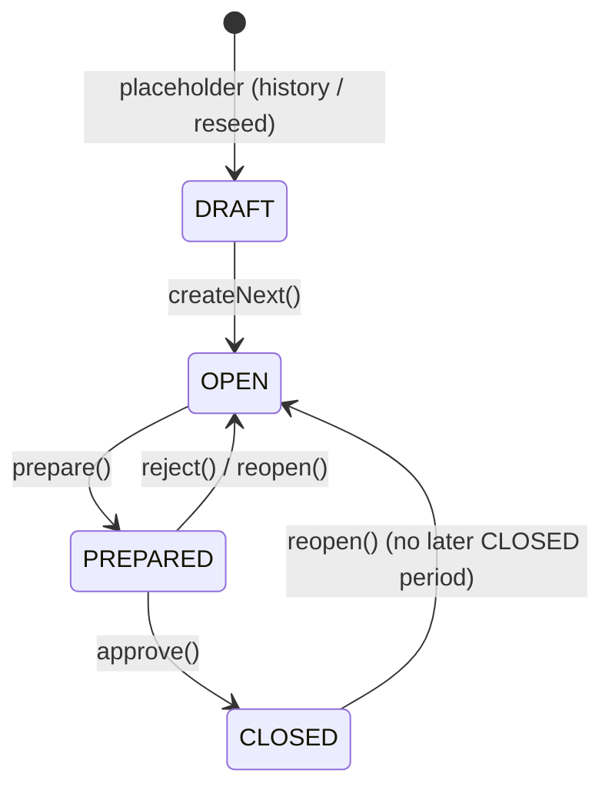
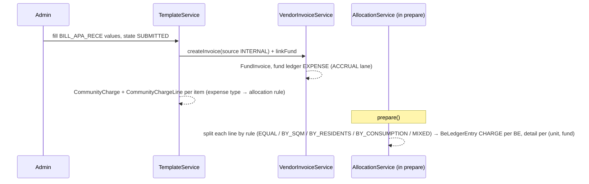
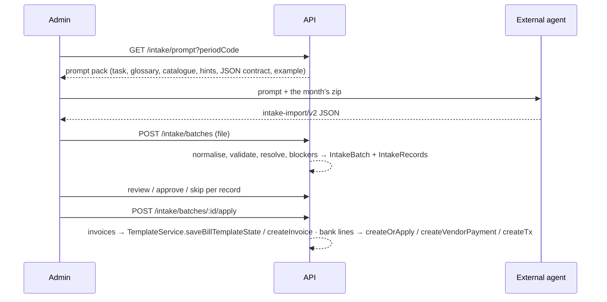

# Flows — how things move through the system

End-to-end journeys, each with the services involved and the rows they leave behind. The domain
vocabulary is in [architecture.md](./architecture.md) and [glossary.md](./glossary.md); the rules
these flows obey are in [principles.md](./principles.md).

## 1. The month (period lifecycle)



During **OPEN** the administrator fills the month: supplier bills via **bill templates**
(one per recurring supplier; `FILLED` while typing, `SUBMITTED` creates the `VendorInvoice` and
its `CommunityCharge` expense lines), meter readings via **meter entry templates**, receipts via
*Plăți*. Submitting or reopening any template moves the period back to OPEN — that is why the
month-close reads them as "closed" before it can prepare.

**`prepare()`** (OPEN → PREPARED, one transaction, `PeriodService`): re-apply payments →
run the allocation rules (bill → per-unit `CommunityChargeLine` → per-BE `BeLedgerEntry` CHARGE
rows, refType `CLOSE_PREP`) → advance penalty aging → apply charge overrides → apply
corrections → `computeStatements` (`BeStatement.dueStart/charges/payments/adjustments/dueEnd`
per BE and fund, plus the community rollup). A metered allocation with a missing reading throws
here and blocks the month ([meters.md](./meters.md)).

**Review** (PREPARED): the *avizier* (the per-owner grid) and the cenzor/committee sign-off
(`cenzor` feature) read the statements. Anything wrong → `reject()`/`reopen()`, fix, prepare again;
corrections are *declarations* and survive the round trip ([corrections.md](./corrections.md)).

**`approve()`** (PREPARED → CLOSED): re-derives overrides and corrections, writes the `CLOSE_FINAL`
legs, commits the penalty buckets, and seeds the next period's opening from `dueEnd`. Reopening a
CLOSED month is allowed only while no later month is CLOSED, and it undoes exactly the `CLOSE_*`
legs it wrote.

Scripts mirror the UI: `npm run prepare:period -- <COMM> <YYYY-MM>`, `reopen:period`,
`close:period`. Never flip `period.status` by hand.

## 2. A supplier bill → per-owner debt



- **Expense type** decides the rule and the fund (`ExpenseType.params.fundCode`); an expense type
  without a fund blocks allocation.
- Bills recorded without a template (`VendorInvoiceService.createInvoice`, source MANUAL/IMPORT)
  create the payable and the fund accrual only — **expense lines to owners come solely from template
  submissions** (`CommunityCharge` with `sourceType VENDOR_INVOICE` is written by `TemplateService`).
- **Payables**: the invoice is "unpaid" until `VendorPayment`s applied to it reach its gross
  (`FinanceService.unpaidVendorInvoices`). Paying it (*Plăți*, or a bank line in intake) posts the
  `PAYMENT_OUT` cash-lane legs and the `CashTx OUT` split by `FundInvoice`.

## 3. A receipt → settled charges

```mermaid
sequenceDiagram
  participant Admin
  participant PS as PaymentService
  participant CS as CashService
  Admin->>PS: createOrApply({ billingEntityId, amount, accountId, refId, allocationSpec?, periodCode? })
  PS->>PS: upsert Payment by refId (idempotent)
  PS->>PS: applyPayment: allocationSpec lines → fixed / marker / advance; else auto-spread by the community strategy
  PS-->>PS: PaymentApplication rows on open BeLedgerEntry CHARGEs; leftover → advance on a fund
  PS->>CS: upsertCashTxForPayment → CashTx IN per fund on the account
```

- The **community strategy** (`Community.paymentAllocation`: FIFO default, LEGAL_PER_PERIOD,
  LEGAL_PENALTIES_FIRST, FUND_PRIORITY) orders the open charges; the operator can pin funds or
  specific charges through `allocationSpec`. Money beyond open charges needs an advance fund or
  the call fails ("Payment exceeds open charges").
- `providerMeta.cycleCode` scopes an imported payment to one collection cycle when `prepare`
  re-applies payments (register imports: "Tabel aprilie" → `2026-04`).
- Statements pick the payment up at the next `prepare`; the avizier shows it as *încasat*.

## 4. Penalties

Each `prepare` advances the **penalty buckets**: per BE, per fund, principal that is past its due
date (period due date + grace days) accrues at the period's rate over the *afisare* window; the
result is a CHARGE on the PENALIZARI fund next month. Buckets are committed on `approve` and
reverted on `reopen`. Details and the Law 196/2018 rules in
[architecture.md §7](./architecture.md#7-penalty-aging) and [kralik.md](./kralik.md).

## 5. Corrections

An admin **declares** a correction (reshuffle, true-up, credit transfer, penalty write-off,
manual adjustment) against a period; `prepare`/`approve` **derive** the ledger legs from the
declaration every time, so declarations can be edited and the month re-prepared without manual
ledger surgery. [corrections.md](./corrections.md).

## 6. AI intake (documents → proposals → books)



The app never calls an LLM; it only writes through the services above. Bank lines can be applied
into PREPARED months (they are payments), invoices need OPEN. [intake.md](./intake.md).

## 7. Migration of a live association

1. **Definition** — `data/<COMM>/def.json` (measure types, meters, allocation rules, expense types,
   structure/units, billing entities with membership history, intake hints), `funds.json`,
   `bill-templates.json`, `meter-templates.json`; imported by `import:community` & friends.
2. **History** — the external export is parsed and injected as ledger-level history
   (`history:parse`, `history:inject`): CHARGE/PAYMENT rows per closed month, penalty buckets,
   opening balances — the avizier of past months reproduces the association's own figures.
3. **Bridge / first live months** — seeded from the handover spreadsheets (`seed-kralik-*`),
   reconciled to the cent against the reference totals ([kralik-reseed-runbook.md](./kralik-reseed-runbook.md)).
4. **Cutover** — from the first app-run month on, everything comes through the flows above.
   State that straddles the line (bank/petty-cash balances, supplier invoices paid after the
   cutover, invoices paid before it) is made explicit with opening rows — [cutover.md](./cutover.md).
5. **Reseed** — the whole chain is a script (`rebuild-kralik*.sh`) so the dataset can be rebuilt
   from committed sources at any time; the runbook's totals are the reference, not prod.

## 8. Owner-facing

Owners (`BILLING_ENTITY_USER`) see their statements, funds, avizier line, events, polls and
notifications through the web (`me/*` routes) and the Expo app; receipts they make appear after
the administrator records them (or the bank statement is intaken).

## 9. Notifications

Domain events (announcement, ticket update, period closed, …) create `Notification` +
`NotificationDelivery` rows; `POST /admin/notifications/process-deliveries` sends the pending ones
by channel (in-app, Expo push, email) according to `NotificationPreference`.
