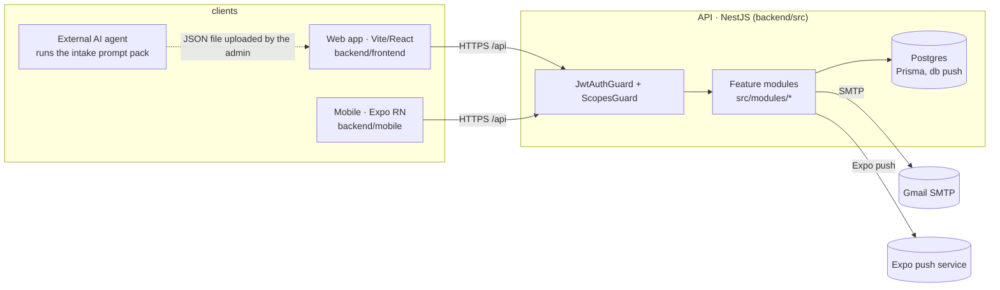
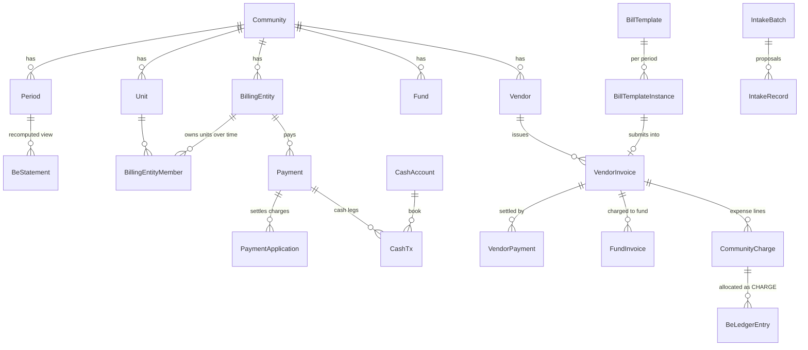

# System overview — components, runtime, cross-cutting concerns

The *domain* (periods, charges, ledgers, payments) is in [architecture.md](./architecture.md); the
*operational flows* in [flows.md](./flows.md); the *design rules* in [principles.md](./principles.md).
This page is the map: what runs where, how a request travels, and the mechanisms every module uses.

## Components

| Piece | Where | Notes |
|---|---|---|
| API | `backend/src` (repo root **is** the backend) | NestJS 10, CommonJS, `ts-node-dev` in dev, `dist/` in prod. Global prefix `/api`. |
| DB | Postgres 16, Prisma | **Push-style schema**: `npx prisma db push`, no migrations folder. Deploy container pushes on start. |
| Web | `backend/frontend` (own `npm` tree) | Vite + React, single page, state in the URL (`?community=<code>&tab=<key>`), EN/RO i18n, metadata-driven labels. |
| Shared | `backend/packages/shared` | API client (`client.ts`, errors carry `status`/`body`), auth storage/hook, shared types — used by web and mobile. |
| Mobile | `backend/mobile` | Expo / React Native for owners: statements, funds, events, push notifications. Same API, same roles. |
| Prod | `wend` host, Docker Compose (`api`, `web` = Caddy, `db`), Cloudflare in front of vicusia.ro | [deployment.md](./deployment.md). |

## Backend layout

`src/app.ts` registers the modules; each is a folder under `src/modules/` with
`*.module.ts / *.controller.ts / *.service.ts`. `PrismaService` lives in `user/prisma.service.ts`.

| Module | Responsibility |
|---|---|
| `auth`, `user`, `invite` | JWT login (email+password, OAuth accounts), refresh tokens, password reset, invitations, role assignment |
| `community` | Tenant + topology (units, groups, billing entities, members, tenants), expense types, allocation rules, vendors, community import/export (`data/<COMM>/*.json`) |
| `period` | The monthly lifecycle: create / prepare / approve / reject / reopen, statements, corrections application, penalty aging |
| `billing` | Templates (bill + meter entry), vendor invoices & payments, payments & allocation (`PaymentService`), cash accounts & cash book (`CashService`), allocation engine |
| `fund` | Funds (money buckets), targets, fund-level views |
| `finance`, `be-financials`, `reports` | Read side: dashboards, avizier, debtors, unpaid invoices, collection rate, risk exposure |
| `corrections` | Declarations (reshuffle, true-up, credit transfer, penalty write-off, manual) with a derived ledger — [corrections.md](./corrections.md) |
| `intake` | AI intake: prompt pack out, agent JSON in, review, apply — [intake.md](./intake.md) |
| `features` | Per-community feature flags (`Community.features`, defaults in `FeaturesService`) |
| `metadata` | The enum/label registry the UI reads (`src/common/enums-meta.ts` → `GET /metadata`) |
| `communications`, `engagement`, `committee`, `ticketing`, `inventory` | Announcements, events/polls, committee decisions & votes, tickets, inventory assets & maintenance rules |
| `notifications`, `notifications-jobs`, `push`, `mail` | In-app / push / email notifications, per-user preferences, the job endpoint that dispatches them, Expo push tokens, SMTP |

Scripts in `src/scripts/` are runnable `ts-node` entry points (`npm run <name>`): imports, reseeds,
period operations, the payment-allocation test, `intake:validate`, `intake-import-file`. There is
**no jest** — integration checks are scripts against a real database ([local-dev.md](./local-dev.md)).

## Request lifecycle

1. `JwtAuthGuard` validates the bearer token (`/api/auth/login` issues access + refresh).
2. `ScopesGuard` enforces `@Scopes({ role, scopeType, scopeParam })` on the handler/controller
   against the user's `RoleAssignment`s: a role is scoped to `SYSTEM` or to one `COMMUNITY`
   (`scopeParam` names the route param holding the community id/code). Roles: `SYSTEM_ADMIN`,
   `COMMUNITY_ADMIN`, `CENSOR`, `EXECUTIVE_COMITEE_MEMBER`, `BILLING_ENTITY_USER`.
3. Controllers are thin; services own the logic and talk to Prisma. Money-moving services run
   their multi-row writes in `prisma.$transaction`.
4. Community routes accept the community **id or code** (`/communities/Kralik/...`); services
   resolve with `ensureCommunityId` / `resolveCommunity`.
5. Errors are Nest `HttpException`s; the shared client rethrows with `status` and `body`, and the
   web UI shows `message` + structured `issues` when present (contract validation, blockers).

## Cross-cutting mechanisms

- **Feature flags** — `Community.features` JSON, keys: `funds meters penalties committee cenzor
  tickets announcements events polls inventory notifications aiIntake`. Read by
  `FeaturesService`; the web dashboard hides tabs (`FEATURE_BY_TAB`) and a global `FeatureGuard`
  refuses routes tagged `@Feature('<key>')` when the flag is off (routes without the tag pass).
  Toggle in *Configurare → Feature toggles* or `POST /communities/:id/features`.
- **Metadata registry** — every enum the UI renders (statuses, kinds, blockers, targets, tones,
  hints, RO/EN labels) lives in `src/common/enums-meta.ts` and is served by `GET /metadata`; the web
  reads it through `useMetadata()`. The frontend never hardcodes domain codes/labels
  ([frontend-conventions.md](./frontend-conventions.md)).
- **i18n** — `frontend/src/i18n/lang.ts` holds EN and RO at full parity (`npm run check:i18n`);
  `t(key, fallback)`; domain labels come from metadata, UI chrome from `lang.ts`.
- **Per-community configuration** on the `Community` row: `features`, `paymentAllocation`
  (FIFO / LEGAL_PER_PERIOD / LEGAL_PENALTIES_FIRST / FUND_PRIORITY), `measureModes` (INDEX vs
  CONSUMPTION per meter type), `intakeHints`; per period: `afisareDate`, due date, penalty rate,
  grace, `waterDifferenceMethod`.
- **Idempotency keys** — external facts carry a `refId` and are upserted by it: payments
  (`cash:<cycle>:<n>`, `bank:<reference>/<amount>`), vendor payments (`bank:…`, `opening:<invoice>`),
  cash rows (`refType`+`refId`), corrections (`originKey`), opening balances. Re-running an import
  never double-books.
- **Provenance** — rows created by imports/intake/scripts carry `provider`, `providerRef`,
  `providerMeta` (payments) or `provenance` JSON (invoices, docs) pointing back at the source
  (batch, record, file, bank reference).
- **Notifications** — events create `Notification` + `NotificationDelivery` rows; a SYSTEM_ADMIN
  call to `POST /api/admin/notifications/process-deliveries` (`notifications-jobs`) dispatches the
  pending ones over IN_APP / PUSH (Expo) / EMAIL (Gmail SMTP), honouring `NotificationPreference`.
  Nothing runs on a timer inside the API — trigger it from the host (cron/curl) or by hand.

## Data at a glance

Durable truth vs recomputed views, lanes (ACCRUAL / CASH) and the three ledgers (BE, community,
fund) are explained in [architecture.md §5](./architecture.md#5-statements--ledger-the-money-truth).

## Environments

| | Local | Prod (wend / vicusia.ro) |
|---|---|---|
| DB | docker `property-db` on **:5540**, db `property_expenses` | compose `db`, same name |
| API | `npm run dev` → **:3100**/api (ts-node-dev, hot reload; `touch src/app.ts` if a change is missed) | compose `api` :3000 behind Caddy |
| Web | Vite **:5173** | built into the `web` (Caddy) image |
| Data | `data/<COMM>/` fixtures; Kralik = real association data (private repo) | reseeded from the same fixtures — [kralik-reseed-runbook.md](./kralik-reseed-runbook.md) |
| Deploy | — | `PROD_HOST=wend-pub ./deploy/push-to-wend.sh` (rsync → build → up; `db push` on start) |

Seed admin locally: `npm run seed` (see [local-dev.md](./local-dev.md)).
